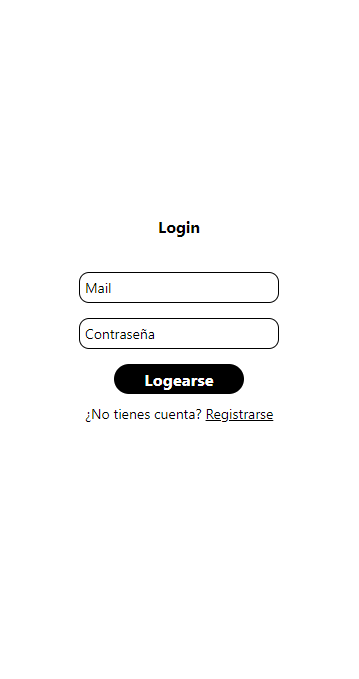

<!-- Improved compatibility of back to top link: See: https://github.com/othneildrew/Best-README-Template/pull/73 -->
<a name="readme-top"></a>
<!--
*** Thanks for checking out the Best-README-Template. If you have a suggestion
*** that would make this better, please fork the repo and create a pull request
*** or simply open an issue with the tag "enhancement".
*** Don't forget to give the project a star!
*** Thanks again! Now go create something AMAZING! :D
-->


<!-- PROJECT SHIELDS -->
<!--
*** I'm using markdown "reference style" links for readability.
*** Reference links are enclosed in brackets [ ] instead of parentheses ( ).
*** See the bottom of this document for the declaration of the reference variables
*** for contributors-url, forks-url, etc. This is an optional, concise syntax you may use.
*** https://www.markdownguide.org/basic-syntax/#reference-style-links
-->


<!-- PROJECT LOGO -->
<br />
<div align="center">
  <a href="https://github.com/arielcn">
    
  </a>

  <h3 align="center">Login RN</h3>

  <p align="center">
    El mejor login para tu aplicacion!
    <br />
    <a href="https://github.com/othneildrew/Best-README-Template"><strong>Explorar los docs »</strong></a>
    <br />
    <br />
    <a href="https://github.com/othneildrew/Best-README-Template">ver demo</a>
    ·
    <a href="https://github.com/othneildrew/Best-README-Template/issues">Reportar Bug</a>
    ·
    <a href="https://github.com/othneildrew/Best-README-Template/issues">solicitar características</a>
  </p>
</div>


<!-- TABLE OF CONTENTS -->
<details>
  <summary>tabla de contenidos</summary>
  <ol>
    <li>
      <a href="#about-the-project">sobre el proyecto</a>
      <ul>
        <li><a href="#built-with">armar con</a></li>
      </ul>
    </li>
    <li>
      <a href="#getting-started">empezando</a>
      <ul>
        <li><a href="#prerequisites">Prerequisitos</a></li>
        <li><a href="#installation">instalacion</a></li>
      </ul>
    </li>
    <li><a href="#usage">uso</a></li>
    <li><a href="#roadmap">mapa vial</a></li>
    <li><a href="#contributing">contribuyendo</a></li>
    <li><a href="#license">licencia</a></li>
    <li><a href="#contact">Contacto</a></li>
    <li><a href="#acknowledgments">reconocimientos</a></li>
  </ol>
</details>


<!-- ABOUT THE PROJECT -->
## Sobre el proyecto

</img>

Hay muchas plantillas README excelentes disponibles en GitHub; sin embargo, no encontré uno que realmente se adaptara a mis necesidades, así que creé este mejorado. Quiero crear una plantilla README tan sorprendente que sea la última que necesites. Creo que esto es todo.

Este es el por qué:
* Tu tiempo debe centrarse en crear algo sorprendente. Un proyecto que resuelve un problema y ayuda a otros
* No deberías hacer las mismas tareas una y otra vez, como crear un archivo README desde cero.
* Debes implementar los principios DRY por el resto de tu vida :sonríe:

Por supuesto, ninguna plantilla servirá para todos los proyectos, ya que sus necesidades pueden ser diferentes. Así que agregaré más en un futuro próximo. También puedes sugerir cambios bifurcando este repositorio y creando una solicitud de extracción o abriendo una incidencia. ¡Gracias a todas las personas que han contribuido a ampliar esta plantilla!

Utilice `BLANK_README.md` para comenzar.

<p align="right">(<a href="#readme-top">back to top</a>)</p>


### Construido con

Esta sección debe enumerar los principales marcos/bibliotecas utilizados para iniciar su proyecto. Deje cualquier complemento/complemento para la sección de agradecimientos. Aquí están algunos ejemplos.

* [![React Native][reactnative.dev]]
* [![Node.js][nodejs.org]]
* [![React][React.js]][React-url]
* [![Bootstrap][Bootstrap.com]][Bootstrap-url]


<p align="right">(<a href="#readme-top">back to top</a>)</p>


<!-- GETTING STARTED -->
## Empezando

Este es un ejemplo de cómo puede dar instrucciones sobre cómo configurar su proyecto localmente.
Para poner en funcionamiento una copia local, siga estos sencillos pasos de ejemplo.

### Prerequisitos

Este es un ejemplo de cómo enumerar los elementos necesarios para utilizar el software y cómo instalarlos.
* npm
  ```sh
  npm install npm@latest -g
  ```

### Instalación

_A continuación se muestra un ejemplo de cómo puede instruir a su audiencia sobre cómo instalar y configurar su aplicación. Esta plantilla no depende de dependencias o servicios externos._

1. Get a free API Key at [https://example.com](https://example.com)
2. Clonar el repo
   ```sh
   git clone https://github.com/your_username_/Project-Name.git
   ```
3. Install NPM packages
   ```sh
   npm install
   ```
4. Enter your API in `config.js`
   ```js
   const API_KEY = 'ENTER YOUR API';
   ```

<p align="right">(<a href="#readme-top">back to top</a>)</p>


<!-- USAGE EXAMPLES -->
## Uso

Utilice este espacio para mostrar ejemplos útiles de cómo se puede utilizar un proyecto. Las capturas de pantalla, ejemplos de código y demostraciones adicionales funcionan bien en este espacio. También puede vincular a más recursos.

_Para más ejemplos, consulte la [Documentation](https://example.com)_

<p align="right">(<a href="#readme-top">back to top</a>)</p>


<!-- ROADMAP -->
## RoadMap

- [x] Login
- [x] Register
- [x] Editar Usuario
- [x] Completar el perfil
- [ ] Añadir foto de perfil

Véase [open issues](https://github.com/othneildrew/Best-README-Template/issues) para obtener una lista completa de las características propuestas (y problemas conocidos).

<p align="right">(<a href="#readme-top">vovler arriba</a>)</p>

<!-- CONTACT -->
## Contacto

Link del proyecto: [https://github.com/arielcn/LoginReactNative](https://github.com/arielcn/LoginReactNative)

<p align="right">(<a href="#readme-top">vovler arriba</a>)</p>


<!-- ACKNOWLEDGMENTS -->
## Conocimiento

Utilice este espacio para enumerar los recursos que le resulten útiles y a los que le gustaría dar crédito. ¡He incluido algunos de mis favoritos para comenzar!
* [Use React Bootstrap](https://react-bootstrap.netlify.app/)

<p align="right">(<a href="#readme-top">volver arriba</a>)</p>


<!-- MARKDOWN LINKS & IMAGES -->
<!-- https://www.markdownguide.org/basic-syntax/#reference-style-links -->
[contributors-shield]: https://img.shields.io/github/contributors/othneildrew/Best-README-Template.svg?style=for-the-badge
[contributors-url]: https://github.com/othneildrew/Best-README-Template/graphs/contributors
[forks-shield]: https://img.shields.io/github/forks/othneildrew/Best-README-Template.svg?style=for-the-badge
[forks-url]: https://github.com/othneildrew/Best-README-Template/network/members
[stars-shield]: https://img.shields.io/github/stars/othneildrew/Best-README-Template.svg?style=for-the-badge
[stars-url]: https://github.com/othneildrew/Best-README-Template/stargazers
[issues-shield]: https://img.shields.io/github/issues/othneildrew/Best-README-Template.svg?style=for-the-badge
[issues-url]: https://github.com/othneildrew/Best-README-Template/issues
[license-shield]: https://img.shields.io/github/license/othneildrew/Best-README-Template.svg?style=for-the-badge
[license-url]: https://github.com/othneildrew/Best-README-Template/blob/master/LICENSE.txt
[linkedin-shield]: https://img.shields.io/badge/-LinkedIn-black.svg?style=for-the-badge&logo=linkedin&colorB=555
[linkedin-url]: https://linkedin.com/in/othneildrew
[product-screenshot]: images/screenshot.png
[Next.js]: https://img.shields.io/badge/next.js-000000?style=for-the-badge&logo=nextdotjs&logoColor=white
[Next-url]: https://nextjs.org/
[React.js]: https://img.shields.io/badge/React-20232A?style=for-the-badge&logo=react&logoColor=61DAFB
[React-url]: https://reactjs.org/
[Vue.js]: https://img.shields.io/badge/Vue.js-35495E?style=for-the-badge&logo=vuedotjs&logoColor=4FC08D
[Vue-url]: https://vuejs.org/
[Angular.io]: https://img.shields.io/badge/Angular-DD0031?style=for-the-badge&logo=angular&logoColor=white
[Angular-url]: https://angular.io/
[Svelte.dev]: https://img.shields.io/badge/Svelte-4A4A55?style=for-the-badge&logo=svelte&logoColor=FF3E00
[Svelte-url]: https://svelte.dev/
[Laravel.com]: https://img.shields.io/badge/Laravel-FF2D20?style=for-the-badge&logo=laravel&logoColor=white
[Laravel-url]: https://laravel.com
[Bootstrap.com]: https://img.shields.io/badge/Bootstrap-563D7C?style=for-the-badge&logo=bootstrap&logoColor=white
[Bootstrap-url]: https://getbootstrap.com
[JQuery.com]: https://img.shields.io/badge/jQuery-0769AD?style=for-the-badge&logo=jquery&logoColor=white
[JQuery-url]: https://jquery.com 